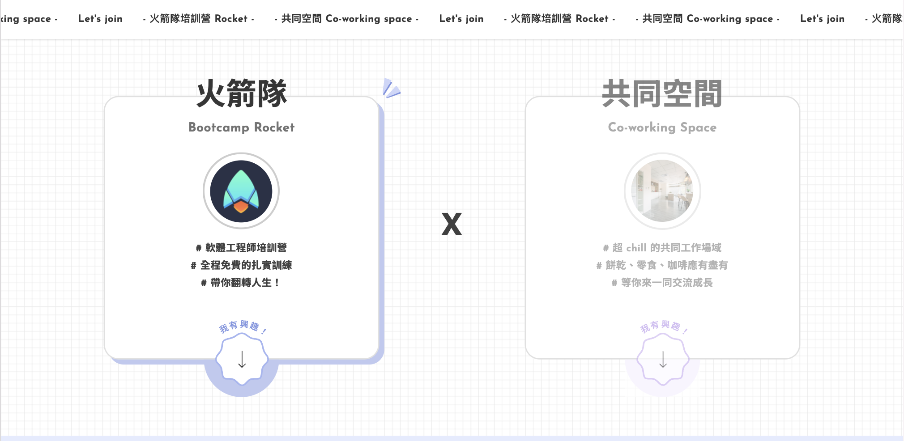
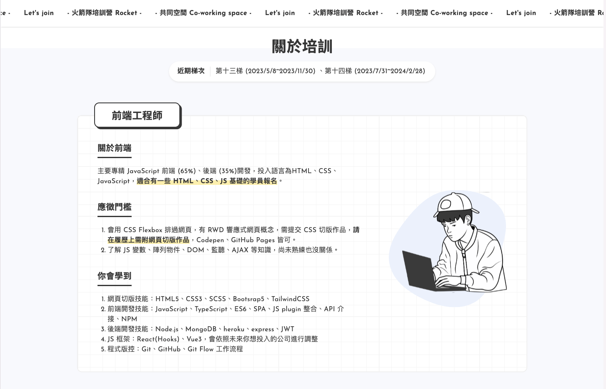
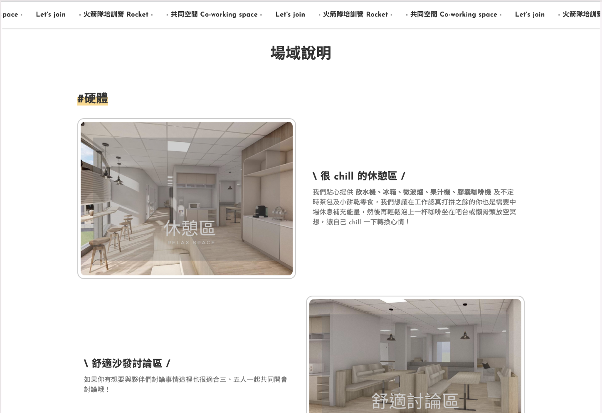
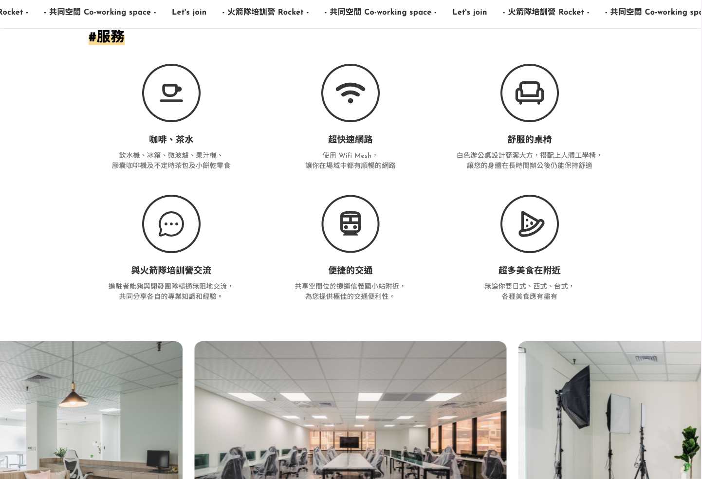
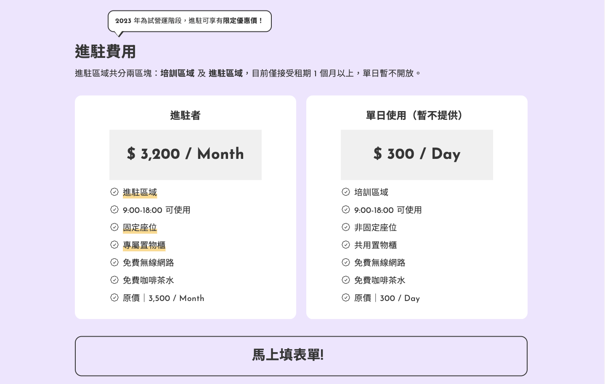

# 🚀 火箭隊培訓營登陸頁與共享辦公空間 | Rocket Landing Page & Coworking Space

[](https://react.dev/)
[](https://vitejs.dev/)
[](https://tailwindcss.com/)


這是一個基於 Figma 設計稿開發的單頁式應用程式（Single Page Application）。不僅展示了 Rocket Boot Camp 的豐富內容，更整合了共享辦公空間 (Coworking Space) 的資訊，透過流暢的動畫與響應式佈局優化的使用者體驗。

設計稿來源：[Figma Design Link](https://www.figma.com/design/OTO27cmalpADJhZmBz3D4h/%E7%81%AB%E7%AE%AD%E9%9A%8A-Landing-page?node-id=0-1&t=s0vjrXr4qXTDX2bO-1)

---
## 👀 專案預覽 | Technical Stack







---

## 🛠 使用技術 | Technical Stack

* **核心框架 (Core)**：React 19.2
* **建構工具 (Build Tool)**：Vite 7.2 
* **樣式處理 (Styling)**：Tailwind CSS 4.1
* **路由管理 (Routing)**：React Router 7.11
* **UI 組件 (UI Components)**：Swiper.js 12.0、Framer Motion 12.2

---

## 📂 專案架構 | Project Architecture

專案將「視覺外觀」與「功能零件」分開存放。這樣的好處是：改顏色時不會動到邏輯，加功能時也不會弄亂樣式。

```text
rocket-landing-page/
├─ public/           # 靜態資源（如：網頁標題icon、README文件的圖片資源）
├─ src/
│  ├─ assets/        # 專案圖像資源（依頁面或功能分類）
│  ├─ styles/        # 樣式管理系統
│  │  ├─ common/     # Design Tokens (顏色、字體、圓角)
│  │  └─ index.css   # 全域 Base Style 入口
│  ├─ components/    # 通用 UI 區塊組件 (Button, Header, Footer 等)
│  ├─ pages/         # 頁面層級組件 (Home, About, Pricing 等)
│  ├─ App.jsx        # 應用程式根組件 (App root)
│  └─ main.jsx       # 專案入口點 (EntryPoint) 
   └─ hooks          # 自定義 Hook
   └─ router         # 路由配置：定義應用程式的路徑對應與導航邏輯。
├─ .gitignore        # Git 忽略清單：定義不需上傳至版本控制的檔案。
├─ eslint.config.js  # 代碼規範設定：定義專案的程式碼品質檢查規則。
├─ index.html        # HTML 模板與字體載入
├─ vite.config.js    # Vite 插件與路徑配置
└─ package.json      # 專案依賴管理與腳本

```

## 🚀 啟動專案 | Quick Start
安裝環境 (Requirement)：請確認電腦已安裝 Node.js。

安裝與啟動 (Setup & Dev)：
```
Bash

npm install
npm run dev
```

## 🤝 協作規範 | Collaboration Guide
🌱 **分支命名規範 (Branch Naming Convention)**

類別 (Category) | 用途 (Usage)                       | 範例 (Example)
---------------|-----------------------------------|----------------------------
feature/       | 新增功能                           | feature/[branch-name]
update/        | 更新、優化（UI & UX、改文案）         | update/[branch-name]
fix/           | 修復 Bug                           | fix/[branch-name]
hotfix/        | 修復重大 Bug                        | hotfix/[branch-name]
chore/         | 初始化專案或環境建置 (npm 安裝)       | chore/[branch-name]

💬 **Commit 訊息規範**
* 用「 類別 + : + 做的事（決定英文或中文）」
* 「：」後面要空格後，再打要做的事。


類別 (Category) | 用途 (Usage)
---------------|------------------------------------------------------------
feat           | 新增功能 (New features)
update         | 修改既有項目或功能（UI / UX 微調、既有功能的行為優化）
fix            | 修復 Bug (Bug fixes)
style          | 格式、風格（不影響程式碼運行的變動，如空白鍵、分號等）
perf           | 改善效能 (Performance improvements)
chore          | 建構程序或輔助工具的變動（如：npm 安裝、文件更新）
refactor       | 重構（既不是修復 Bug 也不是新增功能的程式碼變動）


### **👥 團隊分工 | Team Collaboration**

專案由 3 人小組共同開發，具體分工如下：

#### **子勛 (Project Lead)**
* **管理與規劃**：擔任 PM、負責專案初始化、制定開發規範與專案初始化架構。
* **核心配置**：負責 React Router 路由設定、專案共同協作整合、火箭隊首頁整合。
* **組件開發**：Header、Footer、共享空間頁 - PricingPlansSection。
* **品質管控**：檢查細部排版與最終成果優化。

#### **Ivy**
* **首頁開發**：火箭隊首頁 - SuccessCasesSection (成功案例)、TrainingProgramsSection (訓練課程)。
* **空間開發**：共享空間頁 - SpacesOverviewSection (空間概覽)。
* **技術文件**：負責專案開發文件 (README) 之撰寫與維護。

#### **昱嶔**
* **首頁開發**：火箭隊首頁 - AboutRocketSection (關於火箭)、EnrollmentInfoSection (報名資訊)、PartnersSection (合作夥伴)。
* **空間開發**：共享空間頁 - SharedSpaceSection (共享空間介紹)。

---